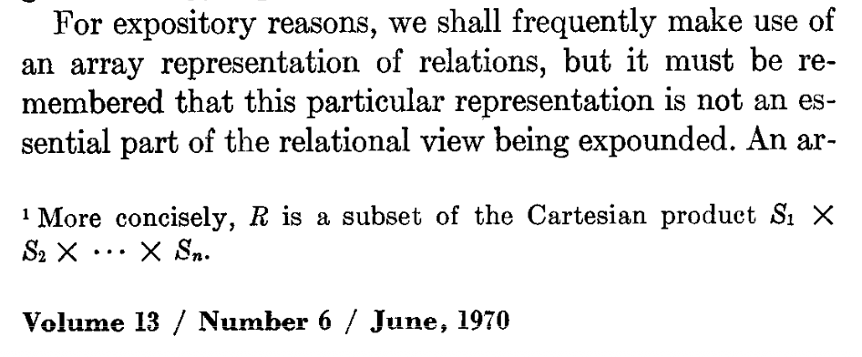

# Introduction

SuperDB is a new analytics database that fuses structured and semi-structured data
into a unified data model called _super-structured data_.
With super-structured data,
complex problems with modern data stacks become easier to tackle
because relational tables and eclectic JSON data are treated in a uniform way
from the ground up.

## Super-structured Data

Super-structured data is strongly typed and self describing.
While compatible with relational schemas, SuperDB does not require such schemas
as they can be modeled as super-structured types.

More specifically, a _relational table_  is simply a collection of tuples
defined by a statically typed record,
while a collection of dynamic but strongly-typed
data can model any sequence of JSON values, e.g., observability data,
application events, system logs, and so forth.

Thus, data in SuperDB is
* strongly typed like databases, but
* dynamically typed like JSON.

Self-describing data makes data easier: when transmitting data from one entity 
to another there is no need for the two sides to agree up front what the schemas
must be in order to communicate and land the data.  Likewise, when extracting and
serializing data from a query, there is never any loss of information as the 
[super-structured formats](formats/intro.md)
capture all aspects of the strongly-typed data whether in 
[human-readable form](formats/sup.md),
[binary row-like form](formats/bsup.md),
or 
[columnar-like form](formats/csup.md).

## The `super` Command

SuperDB is implemented in a single, standalone executable called
[`super`](command.md).
There are no external dependencies to futz with.
Just [install the binary](getting-started/install.md) and you're off and running.

SuperDB separates compute and storage and is decomposed into
a runtime system that
* runs directly on any data inputs like files, streams, or APIs, or 
* manipulates and queries data in a persistant 
storage layer &mdash; the
[SuperDB lakehouse](lakehouse/intro.md) &mdash; that rhymes in design with the emergent
[lakehouse pattern](https://www.cidrdb.org/cidr2021/papers/cidr2021_paper17.pdf)
but is based on super-structured data.

The `super` command can execute the SuperDB runtime without a lakehouse:
```
super -c "SELECT 'hello, world'"
```
To interact with a SuperDB lakehouse, the `super db` subcommands and/or
its corresponding API can be utilized.

> Note that the SuperDB lakehouse is still under development and not yet 
> ready for turnkey production use.

## Why Not Relational?

The _en vogue_ argument against a new system like SuperDB is that SQL and the relational 
model (RM) are perfectly good solutions that have stood the test of time 
and there's no need to replace them. 
In fact, 
[a recent paper](https://db.cs.cmu.edu/papers/2024/whatgoesaround-sigmodrec2024.pdf)
from legendary database experts
argues that any attempt to supplant SQL or the RM is doomed to fail
because any good ideas that arise from such efforts will simply be incorporated 
into SQL and the RM.

Yet, the incorporation of the JSON data model into the 
relational model has left much to be desired.  One must typically choose 
between creating columns of "JSON type" that layers in a parallel set of 
operators and behaviors that diverge from core SQL semantics, or
rely upon schema inference to convert JSON into relational tables,
which unfornately does not always work.

To understand the difficulty of schema inference,
super this simple line of JSON data is in a file called `example.json`:
```json
{"a":[1,"foo"]}
```

> The literal `[1,"foo"]` is a contrived example but adequatedly 
> represents the challenge of mixed-type JSON values, e.g.,
> an API returning an array of JSON objects with varying shape.

Surprisingly, this simple JSON input causes unpredictable schema inference
across different SQL systems.
Clickhouse converts the JSON number `1` to a string:
```sh
$ clickhouse -q "SELECT * FROM 'example.json'"
['1','foo']
```
DuckDB does only partial schema infererence and leaves the contents 
of the array as type JSON:
```sh
$ duckdb -c "SELECT * FROM 'example.json'"
┌──────────────┐
│      a       │
│    json[]    │
├──────────────┤
│ [1, '"foo"'] │
└──────────────┘
```
And Datafusion fails with an error:
```sh
$ datafusion-cli -c "SELECT * FROM 'example.json'" 
DataFusion CLI v46.0.1
Error: Arrow error: Json error: whilst decoding field 'a': expected string got 1
```
It turns out there's no easy way to represent this straightforward
literal array value `[1,'foo']` in these SQLs, e.g., simply including this
value in a SQL expression results in errors:
```sh
$ clickhouse -q "SELECT [1,'foo']"
Code: 386. DB::Exception: There is no supertype for types UInt8, String because some of them are String/FixedString/Enum and some of them are not. (NO_COMMON_TYPE)
$ duckdb -c "SELECT [1,'foo']"
Conversion Error:
Could not convert string 'foo' to INT32

LINE 1: SELECT [1,'foo']
                  ^
$ datafusion-cli -c "SELECT [1,'foo']" 
DataFusion CLI v46.0.1
Error: Arrow error: Cast error: Cannot cast string 'foo' to value of Int64 type
```

The more recent innovation of an open
["variant type"](https://github.com/apache/spark/blob/master/common/variant/README.md)
is more general than JSON but suffers from similar problems.
In both these cases, the JSON type and the variant
type are not individual types but rather entire type systems that differ 
from the base relational type sysetem and so are shoehorned into the relational model
as a parallel type system masquerading as specialized type to make it all work.

Maybe there is a better way?

## Enter Algebraic Types

What's missing here is an easy and native way to represent mixed-type entities.
In modern programming languages, such entities are enabled with a
[sum type or tagged union](https://en.wikipedia.org/wiki/Tagged_union).

While the original conception of the relational data model anticipated 
"product types" --- in fact, describing a relation's schema in terms of
a product type --- it unfortunately did not anticipate sum types:

> While it didn't use the terminology of programming language types,
> Codd's original paper on the relational model has a footnote that
> essentially describes as a product type.
>
> 
>
> But sum types were notably absent.

Armed with both sum and product types, super-structured data provides a 
comprehensive algebraic type system that can represent any
[JSON value as a concrete type](https://www.researchgate.net/publication/221325979_Union_Types_for_Semistructured_Data).
And since relations are simply product types 
as originally envisioned by Codd, any relational table can be represented
also as a super-structure product type.  Thus, JSON and relational tables
are cleanly unified with an algebraic type system.

In this way, SuperDB "just works" when it comes to processing the JSON example
from above:
```sh
$ super -c "SELECT * FROM 'example.json'" 
{a:[1,"foo"]}
$ super -c "SELECT [1,'foo'] AS a" 
{a:[1,"foo"]}
```
In fact, we can see algebraic types at work here if we interrogate the type of 
such an expression:
```sh
$ super -c "SELECT typeof(a) as type FROM (SELECT [1,'foo'] AS a)"       
{type:<[(int64,string)]>}
```
In this super-structured representation, the `type` field is a first-class type value
representing the type array of elements of a sum type of `int64` and `string`.

## SuperSQL

Since super-structured data is a superset of the relational model, it turns out that
a query language for super-structured data can be devised that is a superset of SQL.
The SuperDB query language is a Pipe SQL adapted for super-structured data
scalled _SuperSQL_.

SuperSQL is particularly well suited for data-wrangling use cases like
ETL and data exploration and discovery.  Syntactic shortcuts, keyword search,
and SuperDB Desktop make interactively querying data a breeze.

Instead of operating upon staticly typed relational tables as SQL does,
SuperSQL operates on collections of arbitrarily typed data.
When such data happens to look like a table, the SuperSQL can work just 
like SQL:
```sh
$ super -c '''
SELECT a+b AS x, a-b AS y FROM (
  VALUES (1,2),	(3,0)
) AS T(a,b)
'''
{x:3,y:-1}
{x:3,y:3}
```
But when data does not conform to the relational model, SuperSQL can 
still handle it with its polymorphic runtime:
```sh
$ super -c """
SELECT avg(radius) as R, avg(width) as W FROM (
    yield
      {kind:'circle',radius:1.5},
      {kind:'rect',width:2.0,height:1.0},
      {kind:'circle',radius:2},
      {kind:'rect',width:1.0,height:3.5}
)
"""
{R:1.75,W:1.5}
```

Things get more interesting when you want to do different types of processing 
for differently type entities, e.g., let compute an average radius of circles,
and double the width of each rectangle.  This time we'll use the pipe syntax 
with shortcuts and employ first-class errors to flag unknown types:
```
$ super -c """
yield
  {kind:'circle',radius:1.5},
  {kind:'rect',width:2.0,height:1.0},
  {kind:'circle',radius:2},
  {kind:'rect',width:1.0,height:3.5}
| switch kind (
    case 'circle' => R:=avg(radius)
    case 'rect' => width:=width*2
    default => yield error({msg:'unknown shape',on:this})
  )
"""
{R:1.75}
{kind:"rect",width:4.,height:1.}
{kind:"rect",width:2.,height:3.5}
```
Now if an unknown type shows up, here's what happens:
```
$ super -c """
yield
  {kind:'circle',radius:1.5},
  {kind:'rect',width:2.0,height:1.0},
  {kind:'circle',radius:2},
  {kind:'rect',width:1.0,height:3.5},
  {kind:'square',side:1.5}
| switch kind (
    case 'circle' => R:=avg(radius)
    case 'rect' => width:=width*2
    default => yield error({msg:'unknown shape',on:this})
  )
"""
{R:1.75}
{kind:"rect",width:4.,height:1.}
{kind:"rect",width:2.,height:3.5}
error({msg:"unknown shape",on:{kind:"square",side:1.5}})
```

So what's going on here?  The data model here is acting both 
as a strongly typed representation of JSON-like sequences as well as a 
means to represent relational tables.  And SuperSQL is behaving like SQL
when applied to table-like data, but at the same time is a
pipe-syntax language for arbitrarilty typed data.
The super-structured data model ties it all together.

To make this all work, the runtime must handle arbitrarily typed data.  Hence, every 
operator in the SuperSQL has defined behavior for every possible input type.
This is the key point of departure for super-structured data: instead of the unit of processing being a relational table, which requires a staticly defined schema, the unit of processing is a collection of arbitrarily typed values.
In a sense, SuperDB generalizes Codd's relational algebra to polymorphic operators.
All of Codd's relational operators can be recast in this fashion forming
the polymorphic algebra of super-structured data implemented by SuperDB.

## Performance

A challenge of super-structured data model is that it is inherently more complex
than the relational model and thus poses performance challenges.

That said, the relational model is a special case of the super-structured model
so the myriad of optimization techniques developed for SQL and the relational 
model apply when super-structured data is homogeneously typed.  Moreover, it turns 
out that you can implement a vectorized runtime for super-structured data by 
organizing the data into vectorized units based on types instead of relational columns.

While SuperDB is not setting speed records for relational queries, it's performance
for an early system is decent and will continue to improve.
SQL and the RM have had 55 years to mature and improve and SuperDB is applying 
these lessons step by step 

## Summary and Next Steps

To summarize, SuperDB provides a unified approach to analytics for eclectic JSON data
and uniformly typed relational tables.  It does so in a SQL compatible fashion when 
data looks like relational tables while offering 
a modern pipe sytax suited for arbitrarily typed collections of data.

In other words,
SuperDB does not attempt to replace the relational model but rather leverages it
in a more general approaach based on the super-structured data model were:

* SuperSQL is a superset of SQL,
* the super-structured data model is a superset of the relational model,
* JSON easily and automatically represented with strong typing,
* a polymorphic algebra generalizes the relational algebra, and
* it all has an efficient vectorized implementation.

If this has piqued you're interest at all, feel free to dive in deeper:
* explore the [SuperSQL](super-sql/intro.md) query language,
* learn about the
[super-structured data model](formats/model.md) and
[formats](formats/intro.md) underlyng SuperDB, or
* browse the [tutorials](tutorials/intro.md).

