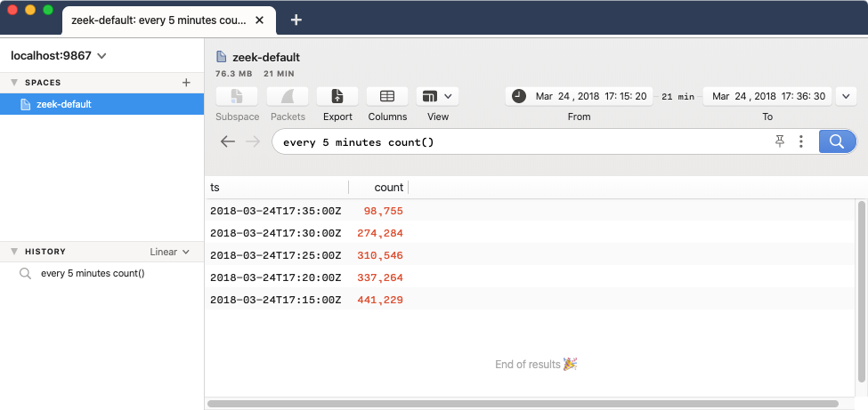

# Grouping

All [aggregate functions](../aggregate-functions/README.md) may be invoked with
one or more _grouping_ options that partition the input stream into batches that are aggregated separately. If explicit grouping is not used, an aggregate function will operate
over all events in the input stream.

Below you will find details regarding the available grouping mechanisms and
tips for their effective use.

- [Time Grouping - `every`](#time-grouping---every)
- [Value Grouping - `by`](#value-grouping---by)
- [Note: Undefined Order](#note-undefined-order)

# Time Grouping - `every`

To create batches of events that are close together in time, specify
`every <duration>` before invoking your aggregate function(s).

The `<duration>` may be expressed in any of the following units of time. A
numeric value may also precede the unit specification, in which case any of
the shorthand variations may also be used.

| **Unit**  | **Plural shorthand (optional)**   |
|-----------|-----------------------------------|
| `second`  | `seconds`, `secs`, `sec`, `s`     |
| `minute`  | `minutes`, `mins`, `min`, `m`     |
| `hour`    | `hours`, `hrs`, `hr`, `h`         |
| `day`     | `days`, `d`                       |
| `week`    | `weeks`, `wks`, `wk`, `w`         |

#### Example #1:

To see the total number of bytes originated across all connections during each
minute:

```zq-command
zq -f table 'every minute sum(orig_bytes) | sort -r ts' conn.log.gz
```

#### Output:
```zq-output head:5
TS                SUM
1521912960.000000 1443272
1521912900.000000 3851308
1521912840.000000 4704644
1521912780.000000 10189155
...
```

#### Example #2:

To see which 30-second intervals contained the most events:

```zq-command
zq -f table 'every 30sec count() | sort -r count' *.log.gz
```

#### Output:
```zq-output head:4
TS                COUNT
1521911940.000000 73512
1521911790.000000 59701
1521912000.000000 51229
...
```

# Value Grouping - `by`

To create batches of events based on the values of fields or the results of
[expressions](../expressions/README.md), specify
`by <field-name | name=expression> [, <field-name | name=expression> ...]`
after invoking your aggregate function(s).

#### Example #1:

The simplest example creates batches based on the values found in a single
field. To see the most commonly encountered Zeek `weird` events in our sample
data:

```zq-command
zq -f table 'count() by name | sort -r' weird.log.gz
```

#### Output:
```zq-output head:5
NAME                                        COUNT
bad_HTTP_request                            11777
line_terminated_with_single_CR              11734
unknown_HTTP_method                         140
above_hole_data_without_any_acks            107
...
```

#### Example #2:

By specifying multiple comma-separated field names, one batch is formed for each
unique combination of values found in those fields. To see which responding
IP+port combinations generated the most traffic:

```zq-command
zq -f table 'sum(resp_bytes) by id.resp_h,id.resp_p  | sort -r sum' conn.log.gz
```

#### Output:
```zq-output head:5
ID.RESP_H       ID.RESP_P SUM
52.216.132.61   443       1781778597
10.47.3.200     80        1544111786
91.189.91.23    80        745226873
198.255.68.110  80        548238226
...
```

#### Example #3:

Instead of a simple field name, any of the comma-separate `by` groupings could
be based on the result of an [expression](../expressions/README.md). The
expression must be preceded by the name that will hold the expression result
for further processing/presentation downstream in your ZQL pipeline.

In our sample data, the `answers` field of Zeek `dns` events is an array
that may hold multiple responses returned for a DNS query. To see which
responding DNS servers generated the longest answers, we can group by
both `id.resp_h` and an expression that evaluates the length of `answers`
arrays.

```zq-command
zq -f table 'len(answers) > 0 | count() by id.resp_h,num_answers=len(answers) | sort -r num_answers,count' dns.log.gz
```

#### Output:
```zq-output head:5
ID.RESP_H       NUM_ANSWERS COUNT
10.0.0.100      16          4
216.239.34.10   16          2
209.112.113.33  15          2
216.239.34.10   14          4
...
```

# Note: Undefined Order

The order of results from a grouped aggregation are undefined. If you want to
ensure a specific order, a [`sort` processor](../processors/README.md#sort)
should be used downstream of the aggregate function(s) in the ZQL pipeline.

#### Example:

If we were counting events into 5-minute batches and wanted to see these
results ordered by incrementing timestamp of each batch:

```zq-command
zq -f table 'every 5 minutes count() | sort ts' *.log.gz
```

#### Output:
```zq-output
TS                COUNT
1521911700.000000 441229
1521912000.000000 337264
1521912300.000000 310546
1521912600.000000 274284
1521912900.000000 98755
```

If we'd wanted to see them ordered from lowest to highest event count:

```zq-command
zq -f table 'every 5 minutes count() | sort count' *.log.gz
```

#### Output:
```zq-output
TS                COUNT
1521912900.000000 98755
1521912600.000000 274284
1521912300.000000 310546
1521912000.000000 337264
1521911700.000000 441229
```

Events that are stored and retrieved via [`zqd`](../../../cmd/zqd) (that is,
using the [Brim application](https://github.com/brimsec/brim) and/or
[`zapi`](../../../cmd/zqd)) are by default automatically sorted in rerverse
order by timestamp (`ts`). Therefore for the particular case of a
[time grouping](#time-grouping---every) query entered via Brim or `zapi`,
if the same reverse time ordering is desired in the output of the aggregation
result, an explicit `| sort -r ts` is _not_ necessary on your ZQL pipeline.

#### Output:


